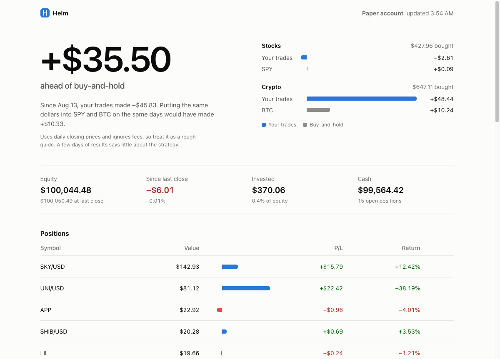

# Kronos paper-trading bot

Trades on an [Alpaca](https://alpaca.markets) **paper** account using price forecasts from
[Kronos](https://github.com/shiyu-coder/Kronos), a time-series foundation model for candlesticks.
Runs daily on GitHub Actions, messages you a summary on Telegram, and has a local web dashboard
where you can watch trades and close positions.



## How it decides

1. Pull ~2 years of daily OHLCV from Yahoo Finance (`yfinance`).
2. Feed the last 400 candles to Kronos-small and forecast the next 10 days (5 sampled paths, averaged).
3. Compare the forecast close on day 10 with the last close:
   - above **+1%** → BUY
   - below **-1%** → SELL
   - otherwise → HOLD

The bot never shorts. SELL only closes a position you already hold.

## The daily run (`python bot.py auto`)

1. **Stop-loss:** close any position down 5% or more from entry (`STOP_LOSS_PCT`). Any pending BUY for that ticker is cancelled first, because Alpaca rejects a sell while an opposite-side order is open. This also runs on its own every 30 minutes, see [Stop-loss workflow](#stop-loss-workflow).
2. **Signal exit:** re-forecast the held positions of this run's asset class (stocks for `auto`, crypto for `auto --crypto`) and close any that flipped to SELL.
3. **Drawdown halt:** if equity is more than 25% below `baseline.json`, skip new buys.
4. **Scan and buy:** forecast the universe (minus what you already hold) and buy `--notional` dollars of each of the top `--top-n` BUY signals
   **you don't already hold** (a buy that's queued or unfilled counts as held, so nothing is bought twice). The crypto run first cancels crypto buys that are still unfilled after 24 hours. With `--budget N`, it stops buying once N dollars are held across all positions.

The universe is the S&P 500 (`auto`) or every tradable Alpaca `/USD` crypto pair (`auto --crypto`).
A failure on one ticker (fetch, forecast or order, including a rejected order) is logged and skipped, it doesn't abort the run.

## Profit reinvestment (`python bot.py rebalance`)

The first run stores your equity in `baseline.json`. Once equity reaches **2x the baseline**, half the
profit is spread evenly across AAPL, MSFT, BTC-USD and ETH-USD (crypto orders need at least $10 each),
and the baseline resets to the current equity. Until then `rebalance` does nothing, so **every other buy
in your order history is a regular `auto` buy, funded from cash, not from profits.**

## Modes

| Command | What it does |
|---|---|
| `python bot.py signal [TICKER...]` | Print BUY/SELL/HOLD and the forecast % |
| `python bot.py backtest [TICKER...]` | Walk-forward direction accuracy (20 windows x 10 days), not P&L |
| `python bot.py trade [TICKER...]` | Place market orders from the signals (`--qty` shares each) |
| `python bot.py recommend [--crypto] [--top-n N] [--limit N]` | Show top BUY/SELL picks without trading |
| `python bot.py auto [--crypto] [--notional 2] [--top-n 5] [--budget N] [--limit N]` | The daily run above |
| `python bot.py rebalance [TICKER...] [--split 4]` | Profit reinvestment above |
| `python bot.py stoploss` | One stop-loss pass, then a Telegram message if anything was sold (what the 30-minute workflow runs) |
| `python bot.py watch [--interval 60]` | Loop forever checking stop-losses, for running on your own machine |
| `python bot.py report` | Send the Telegram summary |
| `python bot.py web [--port 8000]` | Start the local dashboard |

Alpaca only trades US-listed stocks and crypto, so ASX (`.AX`) and IDX (`.JK`) tickers work for
`signal` and `backtest` only.

## Setup

```bash
git clone --recurse-submodules https://github.com/marcokenata-1/kronos-trade-bot.git
cd kronos-trade-bot
python3.12 -m venv .venv && source .venv/bin/activate
pip install -r requirements.txt
```

Create `.env` (gitignored):

```
ALPACA_PAPER_API_KEY=...
ALPACA_PAPER_SECRET_KEY=...
TELEGRAM_BOT_TOKEN=...
TELEGRAM_CHAT_ID=...
```

Python 3.12 is required: `pandas==2.2.2` (pinned by Kronos) has no 3.13 wheel and needs `numpy<2`.
Forecasts run on CPU, since Kronos's attention dropout isn't supported on Apple's MPS backend.

**Paper only by default.** Live trading needs `ALPACA_LIVE=1` plus a separate `ALPACA_LIVE_API_KEY` /
`ALPACA_LIVE_SECRET_KEY` pair. The dashboard shows a red bar and "Live account, real money" when that is set.

Before going live: `baseline.json` holds the **paper** account's equity, so the 25% drawdown halt would block every
buy on a small live account. Give live its own baseline first. Use `--budget` so a small account can't be spent in a day
(crypto orders need at least $10 each).

## Scheduled run (GitHub Actions)

`.github/workflows/daily-trade.yml` runs at 22:00 UTC (08:00 AEST) and on manual dispatch:
`auto`, then `auto --crypto --notional 10`, then `rebalance`, commits `baseline.json`, then `report`
(which always runs, even if an earlier step failed).

Add these as **environment secrets** on the `Paper API Key` environment (Settings > Environments):
`ALPACA_PAPER_API_KEY`, `ALPACA_PAPER_SECRET_KEY`, `TELEGRAM_BOT_TOKEN`, `TELEGRAM_CHAT_ID`.
Don't add the live keys there.

`run_daily.sh` is a local cron alternative that runs the same steps and removes itself after 7 days.

### Stop-loss workflow

`.github/workflows/stop-loss.yml` runs `python bot.py stoploss` every 30 minutes and on manual dispatch. It doesn't
check out the Kronos submodule or install torch (the model is imported lazily), so a run takes seconds. If it sells
something, it messages you on Telegram straight away, since a separate job's notes can't reach the daily report.
It uses the same four secrets as the daily run. Public repos run Actions for free; on a private repo each run
uses about a minute of your monthly allowance, so change the `cron` line if that adds up.

## Telegram report

Sent by `python bot.py report` after the daily run:

```
Helm daily report
Equity: $10,250.00  (yesterday $10,000.00, +250.00 / +2.50%)

Today's moves:
- BOUGHT $2.00 AAPL: Kronos forecasts +3.20% over the next 10 days (BUY above +1%, order ...)
- SOLD XYZ: Kronos forecast flipped to -2.10% over the next 10 days

Vs buy-and-hold (same dollars, same days):
- Stocks: bot -$2.61 vs SPY +$0.09 on $427.96 bought
- Crypto: bot +$50.25 vs BTC +$10.63 on $647.11 bought

Holdings (12, top 10 by value):
- BTCUSD: $55.50 (-2.00%)
```

Each step writes what it did and why to `.daily_events.log` as it goes; `report` reads it, sends it,
and clears it. "Yesterday" is Alpaca's `last_equity` (previous trading-day close). To get your chat ID,
message your bot, then open `https://api.telegram.org/bot<TOKEN>/getUpdates` and look for `chat.id`.
If the variables aren't set, `report` just prints the message.

## Local dashboard

It leads with one question: **is the bot beating buy-and-hold?** Below that: equity, cash and how much is actually
invested, every open position with its return, and the 50 most recent orders. It refreshes every 30 seconds and
follows your macOS light/dark setting.

**Open it like an app (macOS):**

```bash
./install_dashboard.sh              # once: builds ~/Applications/Helm.app (drag it to your Dock if you like)
./install_dashboard.sh --uninstall  # removes it
```

Opening **Helm** starts the server and opens the page in your default browser. Close the page and the server shuts
itself down a few seconds later, so nothing keeps running or listening. Opening the app again just restarts it
(a couple of seconds). If your browser crashes before it can say goodbye, the server keeps running until you open
Helm and close the page again, or run `pkill -f "bot.py web"`.

Not on macOS, or prefer a terminal? `python bot.py web` (then open http://localhost:8000) runs it until you stop it;
add `--exit-when-closed` for the close-to-stop behaviour. Safari's File > Add to Dock also works, but only while the
server is already running, since a Dock web app can't start it.

The server is light: about 100 MB of RAM, no CPU while idle, and it never loads the Kronos model.
Edits to `dashboard.html` show up on the next refresh; after editing `bot.py`, close and reopen Helm.
Errors and startup output go to `dashboard.log`. Two open tabs share one server, so closing either stops it.

It listens on `127.0.0.1` only, has no login, and refuses requests with a foreign `Host` header, and POSTs that
don't come from its own page (custom header, or a same-origin `Origin`), so other web pages can't drive it or shut
it down. Don't expose it beyond localhost.

GitHub Pages isn't an option for this: it's static, so it can't hold your API keys or place orders.

### Buy-and-hold benchmark

For every filled order, the same dollars are put into SPY (for stock trades) or BTC (for crypto trades) on the same
day, and both sides are valued at today's price. That isolates whether the picks and timing helped, not just how much
money went in. It uses daily closing prices, ignores fees, and only sees the last 500 orders, so it's a rough guide.
Only a few days of trades says little about the strategy either way.

## Human override

The bot trades on its own. The dashboard's **Close** button sells a whole position at market.

To **stop new buys**, turn off the Daily Trade workflow in GitHub (Actions > Daily Trade > "..." > Disable workflow).
Leave **Stop-loss check** on so losing positions still get sold. Turn Daily Trade back on to resume.

## Settings

Constants at the top of `bot.py`:

| Name | Default | Meaning |
|---|---|---|
| `LOOKBACK` / `PRED_LEN` | 400 / 10 | Candles in, days forecast |
| `SIGNAL_THRESHOLD` | 1% | Forecast move needed for BUY/SELL |
| `SAMPLE_COUNT` | 5 | Forecast paths averaged per ticker |
| `STOP_LOSS_PCT` | 5% | Sell a position down this much |
| `DRAWDOWN_HALT_PCT` | 25% | Stop new buys this far below baseline |
| `MARKETS` | see file | Tickers for `signal`, `backtest`, `trade` and the `rebalance` pool |

## Tests

Plain assert scripts, no framework:

```bash
for t in test_*.py; do python $t; done
```

## Known limits

- Stop-loss runs about every 30 minutes, not instantly: GitHub can delay scheduled runs, and a stock sold while the market is closed waits for the open. It's a check on current P/L, not an order sitting at Alpaca. Alpaca doesn't take stop orders on dollar-amount (fractional) buys, which is what this bot places.
- A 5% stop is tight for crypto, where a 5% daily move is normal. Expect some sells that would have recovered, and a rebuy the next day if the signal is still BUY.
- **The daily run is slow, because forecasting is CPU-bound.** Measured on an 8-thread Mac: about 4.2s per ticker at
  `SAMPLE_COUNT = 5`, so roughly 570 forecasts (503 stocks, 36 crypto pairs, plus held positions) is around 40 minutes,
  and a GitHub runner has fewer cores: the full-universe daily runs there have taken 1h38m to 2h04m. Batching tickers through Kronos's `predict_batch` gave no speedup on CPU
  (4.2s vs 4.4-4.6s per ticker). What does help: `SAMPLE_COUNT = 2` (1.8s per ticker, but noisier forecasts),
  a smaller universe (`--limit`, though the S&P list is alphabetical, so it favours A-names), or a faster machine.
  On a private repo, a long daily run can also use up the free Actions minutes.
- Yahoo Finance prices are used for signals, Alpaca fills may differ.
- Everything is a market order.
- Nothing here is financial advice, and paper results don't predict live results.
